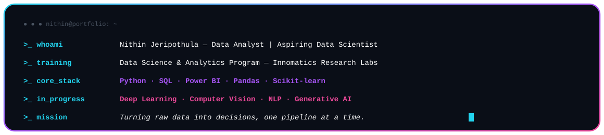
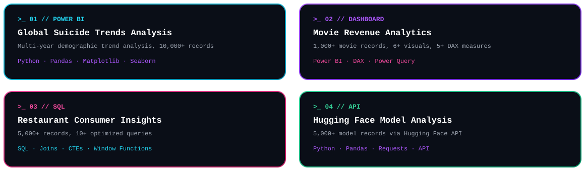

 

## About Me

 

## 💻 System Diagnostics / Core Skillset Inventory

 

## 🛠️ Neural Specifications / Technical Stack

**Languages & Databases**

**Data Analysis & Visualization**

**Machine Learning & Statistics**

**Currently Exploring**

**Tools**

 

## Featured Projects

 

<table>
<tr>
<td width="50%">

**[Global Suicide Trends Analysis](https://github.com/Nithiin05/global-suicide-trends-analysis)**

Interactive Power BI dashboard analyzing global trends across age, gender, and region using 10,000+ records, with DAX measures and Power Query transformations.

   

</td>
<td width="50%">

**[Movie Revenue Analytics Dashboard](https://github.com/Nithiin05/movie-revenue-analytics-dashboard)**

Interactive dashboard analyzing 1,000+ movie records with slicers, filters, and 5+ DAX measures for revenue and rating insights.

  

</td>
</tr>
<tr>
<td width="50%">

**[Restaurant Consumer Insights](https://github.com/Nithiin05/restaurant-consumer-insights-sql)**

SQL analysis of 5,000+ restaurant records using joins, CTEs, subqueries, and window functions to surface pricing and cuisine trends.

 

</td>
<td width="50%">

**[Hugging Face Model Analysis](https://github.com/Nithiin05/huggingface-model-analysis)**

Analysis of 5,000+ ML model records pulled from the Hugging Face API, examining popularity trends by downloads, task type, and library.

  

</td>
</tr>
</table>

 

## GitHub Analytics

 

  

 

## Connect

